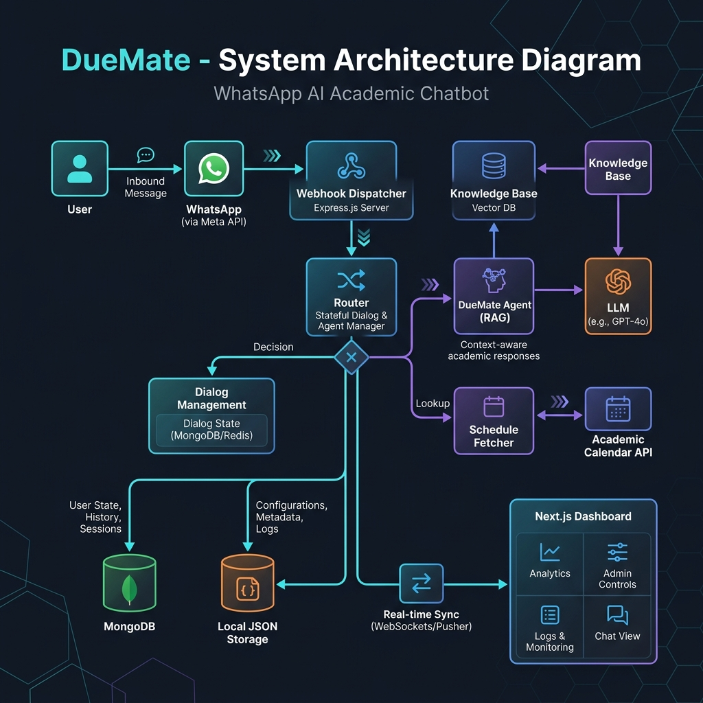
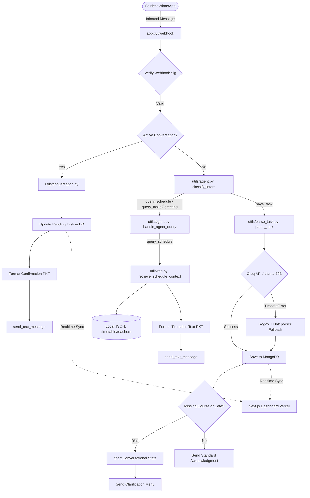

# DueMate System Architecture & Technical Specifications

DueMate is a hybrid deterministic-stateful academic assistant designed to automate student task tracking (assignments and quizzes) and timetable lookup. It leverages a lightweight routing pipeline, deterministic temporal and mapping engines, and LLM-based structured extraction.

---

## 🗺️ High-Level System Architecture



The following diagram illustrates the lifecycle of an incoming WhatsApp message, highlighting the routing prioritization, database mutations, and external integrations.



---

## 🛠️ Key Architectural Components

### 1. Webhook Dispatcher & State Machine (`app.py`)
- **Signature Verification**: Validates inbound requests from Meta's API using `X-Hub-Signature-256` and the HMAC app secret.
- **Active Dialogue Precedence**: When a student responds to a follow-up question (e.g. providing a course abbreviation like `te`), the webhook prioritizes the active conversation state handler **before** the message is evaluated by intent routers.
- **Pipeline Segregation**: Prevents short, context-dependent multi-turn replies from being intercepted by LLM routing or RAG schedule engines.

### 2. Conversational Dialogue Manager (`utils/conversation.py`)
- **Clarification Loop**: Triggered when a new task is created but is missing a course, due date, or both.
- **State Machine**:
  - `awaiting_course`: Asks the user to pick from a pre-defined course menu or supply an alias.
  - `awaiting_date`: Asks the user to provide the deadline (relative or absolute).
- **Graceful Lifecycle Transitions**: Once resolved, the conversation state is destroyed, and the corresponding task's status is automatically updated to `"pending"` (removing the `"needs_review"` flag) to ensure immediate synchronization with the main dashboard.

### 3. Course-ID and Normalization Engine
- **Course Mapping Table**: Resolves informal text inputs to a single, database-aligned canonical string.
- **Bi-directional Normalization**:
  - `utils/parse_task.py: COURSE_ALIASES` maps user-supplied text like `techno`, `parallel`, `asd` to canonical forms.
  - `utils/rag.py: _COURSE_MAPPINGS` resolves teacher names and course abbreviations to short course IDs for fast schedule extraction.

### 4. Timezone-Aware Processing Engine (PKT UTC+5)
- **Timezone-Aware DB Connection**: MongoDB client initialized with `tz_aware=True`. This ensures datetimes retrieved from MongoDB maintain their UTC zone markers rather than converting to naive Python Datetime instances.
- **Frontend Localization Parity**: Serves fully ISO-8601 qualified strings (`YYYY-MM-DDTHH:MM:SS+00:00`) to the Next.js React frontend. The browser's native JavaScript `Date` API automatically localized these offsets to local PKT display.
- **Conversational Formatter**: Converts database UTC dates to PKT dynamically before formatting WhatsApp text templates:
  ```python
  due_pkt = due_date.astimezone(timezone(timedelta(hours=5)))
  ```

---

## 📋 Data Schema Mapping

### Task Document (MongoDB `tasks` Collection)
```json
{
  "_id": "ObjectId",
  "user_id": "string",
  "phone_number": "string",
  "task_type": "assignment | quiz",
  "raw_message": "string",
  "parsed_course": "string | null",
  "parsed_title": "string | null",
  "parsed_due_date": "ISODate (UTC)",
  "has_explicit_time": "boolean",
  "needs_review": "boolean",
  "status": "pending | completed | needs_review",
  "created_at": "ISODate",
  "updated_at": "ISODate"
}
```

---

## ⚡ Latency & Reliability Enhancements

1. **Zero-API Schedule Lookups**: All timetable queries are handled locally using deterministic Python heuristics parsing structured JSON data (`timetable.json`, `teachers.json`). There is zero dependency on external LLMs or vector databases, capping response time to **<10ms**.
2. **Regex + Dateparser Fallback**: If the Groq API fails or is rate-limited, the system falls back to a deterministic rule-based extractor. It extracts titles, dates, and course matches offline, ensuring the bot remains online.
3. **Optimized DB Indexing**: Multi-key indices exist on `user_id`, `status`, `needs_review`, and `parsed_due_date` for fast task rendering on the frontend dashboard.
